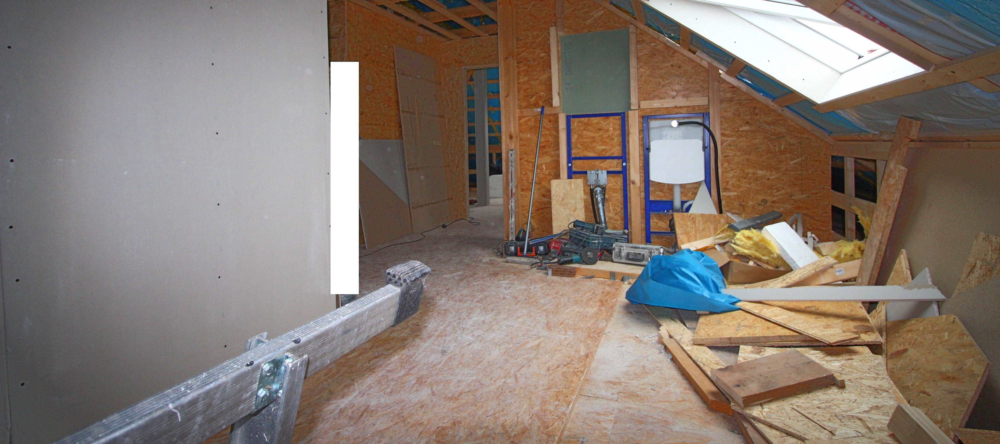
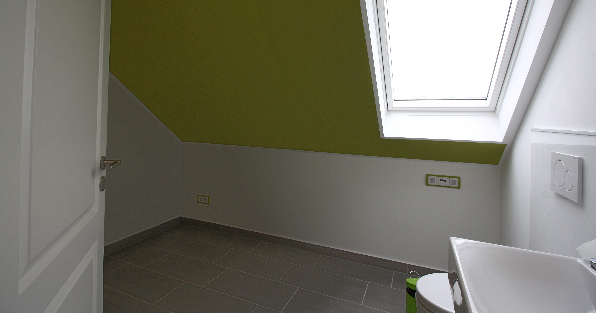
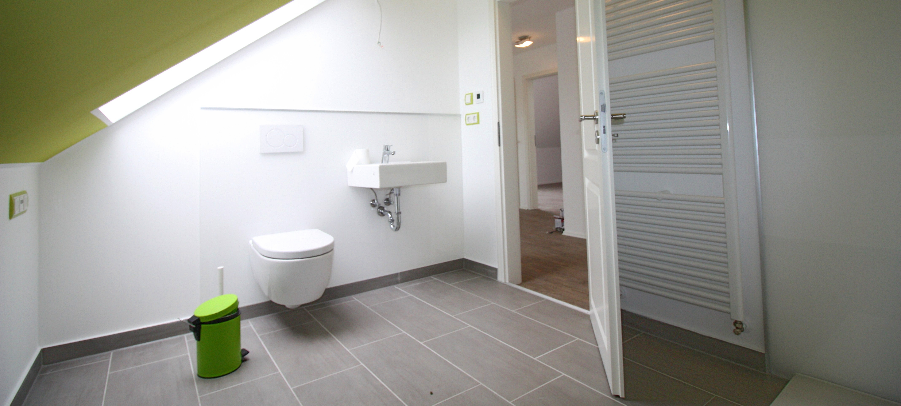
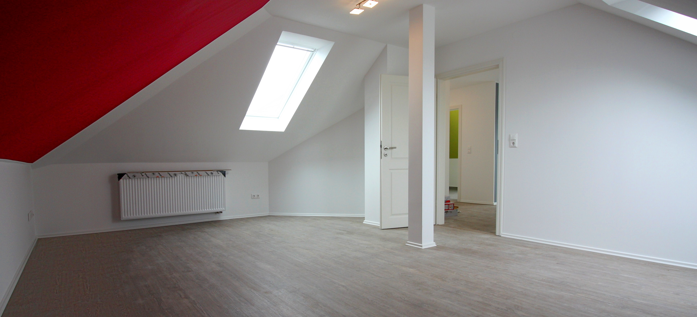
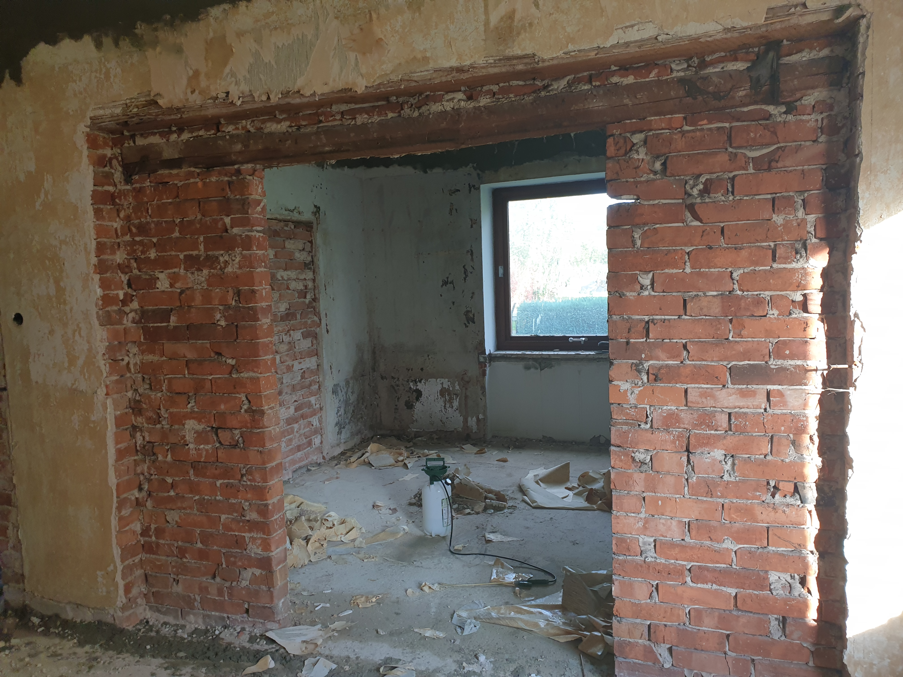

<!DOCTYPE html>
<html lang="pl">
<head>
    <meta charset="UTF-8">
    <meta name="viewport" content="width=device-width, initial-scale=1.0">
    <title>Galery</title>
    
</head>
<body>

<h2>Galery</h2>

    
    
    

    &times;
    

</body> 
</html>
